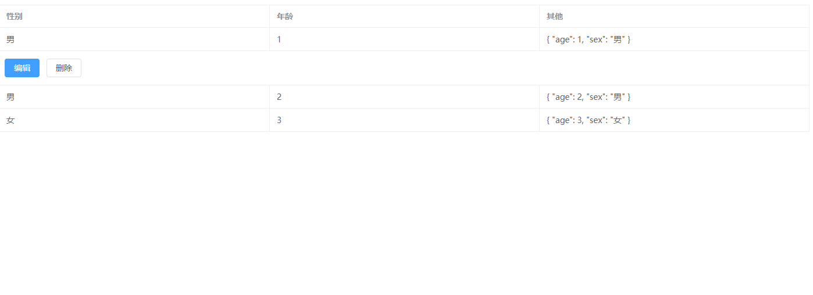

# ly-table-next 基于 element 简单封装的 table

# 1.npm 安装

    <!-- 需要安装element plus -->
    npm i ly-table-next

# 2. main.js/ts 引入

    import LyTableLast from "ly-table-last";
    app.use(LyTableLast)

# 3. 组件内使用

       <LyTableLast />

# 4.示例图片
  

# npm发布方案
   详情见(https://blog.csdn.net/weixin_46194350/article/details/134685465)
